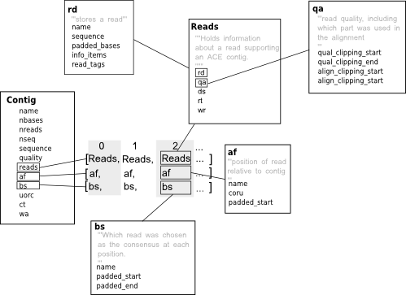

This page describes the **Contig** class used in **Bio.Sequencing.Ace**
to hold all of the information about a single contig record in an Ace
file.

A contig is a set of overlapping sequences used to generate a consensus
sequence for a given region of a genome. Ace files are usually used to
store contigs (that is a consensus sequence and the DNA sequences that
are used to generate it) created with
[phrap](http://www.phrap.org/phredphrapconsed.html) or as part of [454
sequencing projects](http://en.wikipedia.org/wiki/454_Life_Sciences).
Biopython's ace contig class follows the the structure ace file format
closely so if you are not familiar with these files (a description of
the format can be found under the heading "ACE FILE FORMAT" in the
[consed
readme](http://bozeman.mbt.washington.edu/consed/distributions/README.14.0.txt))
it might represent a steep learning curve - the diagram below gives an
overview of how some of the most important information is stored.

Summary Diagram
---------------



Examples
--------

### Treating contigs as sequences

As we've said contigs can be used to represent a sequence corresponding
to some part of a genome (or transcripome or whatever -ome it is that
you are studying). Treating contigs as sequences is pretty straight
forward, using the contig class you can do it this way:

``` python
#Start by parsing a file to get some contigs 
>>>from Bio.Sequencing import Ace
>>>ace_gen = Ace.parse(open("contig1.ace", 'r')) # from Tests/Ace/contig1.ace
>>>contig = ace_gen.next()

# Now do some stuff with them
# what's our contig called
>>> contig.name
'Contig1'
# just the consensus sequence
>>>contig.sequence[:78]
'aatacgGGATTGCCCTAGTAACGGCGAGTGAAGCGGCAACAGCTCAAATTTGAAATCTGGCCCCCCGGCCCGAGTTGT'
# assembler designated quality for each base in the consensus
>>> contig.quality[:20]
[0, 0, 0, 0, 0, 0, 22, 23, 25, 28, 34, 47, 61, 46, 39, 34, 34, 30, 30, 31]
```

Ace files are also supported by the [SeqIO](SeqIO "wikilink") module

``` python
>>>from Bio import SeqIO
>>>ace_gen2 = SeqIO.parse(open("contig1.ace", 'r'), 'ace')
>>>new_contig = ace_gen2.next()
>>>print new_contig
ID: Contig1                                                                                                                                        
Name: Contig1
Description: <unknown description>
Number of features: 0
Per letter annotation for: phred_quality
Seq('aatacgGGATTGCCCTAGTAACGGCGAGTGAAGCGGCAACAGCTCAAATTTGAA...tac', Gapped(DNAAlphabet(), '-'))

# You can do all the normal SeqIO tricks like file conversion
>>>sequences = SeqIO.parse(open("contig1.ace", 'r'), 'ace')
>>>SeqIO.write(sequences, open("ace1_consesus.fasta", "w"), "fasta")
```

### Treating contigs as alignments

``` python
# Ace files also contain information on the reads that make up the consensus.
# Information about the reads are in two lists, "reads" and "af"

# so, to get read sequence for every read in a contig
# and that reads position in its contig
>>>for i in range(len(contig.reads)):               
...     contig.af[i].padded_start           
...     contig.reads[i].rd.sequence
...                                
'tagcgaggaaagaacccaacaGg...'
-14  
'aatacgGGATTGCCCTagtaacG...'
1
```
